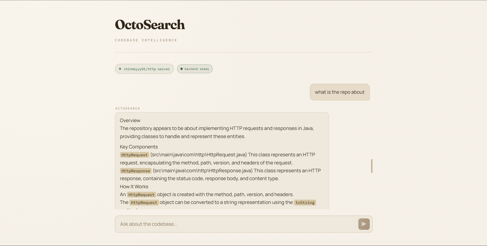
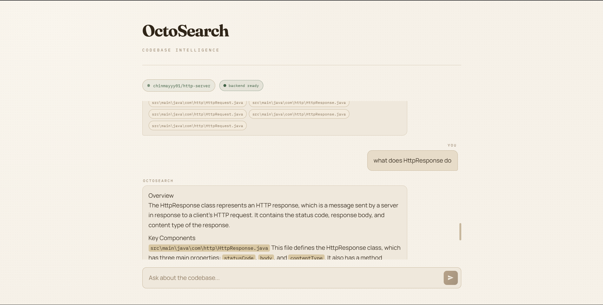

# OctoSearch

OctoSearch is a full-stack codebase Q&A app. It clones a GitHub repository, builds a hybrid retrieval index (vector + BM25), and answers natural-language questions with grounded code snippets.

## Features

- Query public GitHub repositories in natural language.
- Hybrid retrieval with FAISS embeddings + BM25 keyword search.
- Structured LLM answers with source snippets.
- FastAPI backend and React + Vite frontend.

## Tech Stack

- Backend: FastAPI, Uvicorn
- Retrieval: sentence-transformers, FAISS, rank-bm25
- LLM: Groq API (`llama-3.3-70b-versatile`)
- Frontend: React, Vite, Tailwind CSS

## Architecture

1. User submits a repository URL.
2. Backend clones and parses code files.
3. Files are chunked and embedded.
4. Chunks are indexed in FAISS and BM25.
5. Query retrieves top hybrid matches.
6. LLM generates a structured answer from retrieved context.

## Project Structure

```text
octosearch/
|-- api.py                     # Root app entry that loads backend/api.py
|-- README.md
|-- requirements.txt
|-- backend/
|   |-- api.py                 # FastAPI app and routes
|   |-- requirements.txt
|   |-- core/
|   |   |-- ingest.py          # Clone + load repository files
|   |   |-- embedding.py       # Embedding generation
|   |   |-- vector_store.py    # FAISS vector index
|   |   |-- bm25.py            # BM25 retriever
|   |   |-- rag.py             # Hybrid retrieval + answer flow
|   |   |-- llm.py             # Groq LLM integration
|   |-- utils/
|   |   |-- file_loader.py
|   |   |-- chunking.py
|-- frontend/
|   |-- package.json
|   |-- .env.example
|   |-- src/
|   |   |-- App.jsx
|   |   |-- main.jsx
|   |   |-- services/
|   |   |   |-- octoApi.js     # Frontend API client
|   |   |-- components/
|   |       |-- chat/
|   |       |-- layout/
|   |       |-- load/
|-- docs/
|   |-- Screenshot1.png
|   |-- Screenshot2.png
|-- data/
|   |-- repos/                 # Cloned repositories for indexing
|-- scripts/
|   |-- build_index.py
|   |-- test_search.py
|   |-- test_rag.py
```

## Prerequisites

- Git
- Python 3.10+
- Node.js 18+ (Node.js 20 recommended)
- npm 9+
- A Groq API key

## Environment Variables

### Backend

Required:

- `GROQ_API_KEY`: API key for answer generation.

Optional:

- `ALLOWED_ORIGINS`: Comma-separated CORS origins.
	Default: `http://localhost:5173,http://127.0.0.1:5173`

Copy `.env.example` to `.env` in the project root, then update values:

```env
GROQ_API_KEY=your_groq_api_key_here
ALLOWED_ORIGINS=http://localhost:5173,http://127.0.0.1:5173
```

### Frontend

Optional:

- `VITE_API_BASE_URL`: Backend base URL.
	Default: `http://127.0.0.1:8000`

Create `frontend/.env` from `frontend/.env.example` if needed:

```env
VITE_API_BASE_URL=http://127.0.0.1:8000
```

## Installation

### 1. Clone

```bash
git clone <your-repo-url>
cd octosearch
```

### 2. Backend setup

Windows PowerShell:

```powershell
python -m venv .venv
.\.venv\Scripts\Activate.ps1
pip install -r backend/requirements.txt
```

macOS/Linux:

```bash
python3 -m venv .venv
source .venv/bin/activate
pip install -r backend/requirements.txt
```

### 3. Frontend setup

```bash
cd frontend
npm install
cd ..
```

## Run Locally

Start backend (from project root):

```bash
uvicorn api:app --reload
```

Start frontend (new terminal):

```bash
cd frontend
npm run dev
```

Open:

- `http://localhost:5173`

## API

### `POST /load_repo`

Starts asynchronous indexing for a repository.

Request body:

```json
{ "repo_url": "https://github.com/owner/repo" }
```

Response:

```json
{ "message": "Repository loading started..." }
```

### `POST /query`

Queries the indexed repository.

Request body:

```json
{ "query": "How does authentication work?" }
```

If indexing is still running:

```json
{ "message": "Index building... please wait" }
```

If ready:

```json
{
	"answer": "...",
	"sources": [
		{ "path": "...", "snippet": "..." }
	]
}
```

### `GET /`

Health status:

```json
{ "status": "building" }
```

or

```json
{ "status": "ready" }
```

## Usage

1. Open the app in the browser.
2. Paste a GitHub repository URL and load it.
3. Wait until indexing completes.
4. Ask questions about the codebase.
5. Review the generated answer and source snippets.

## Troubleshooting

- If frontend cannot reach backend, set `VITE_API_BASE_URL` correctly.
- If CORS errors appear, update `ALLOWED_ORIGINS`.
- If answers fail, verify `GROQ_API_KEY` is set.
- Initial indexing can be slow on large repositories.

## Limitations

- Indexing time scales with repository size.
- LLM responses are constrained to retrieved context quality.
- Best experience is local development with sufficient CPU/RAM.

## Demo


